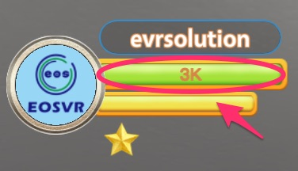
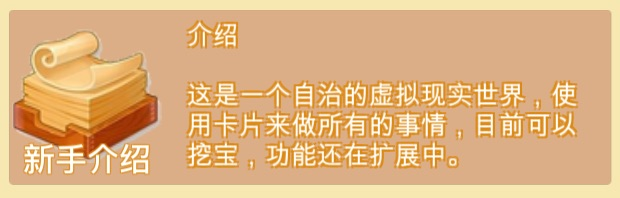
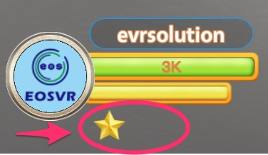
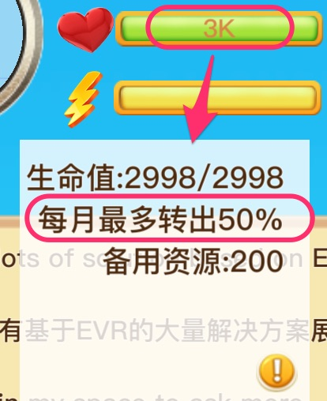
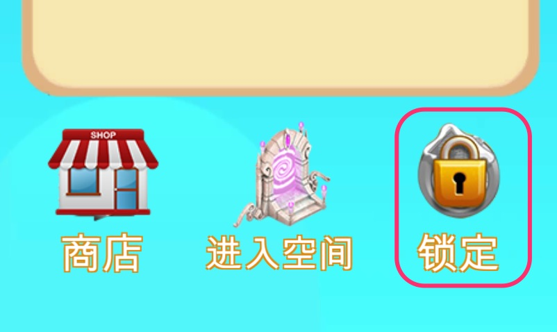
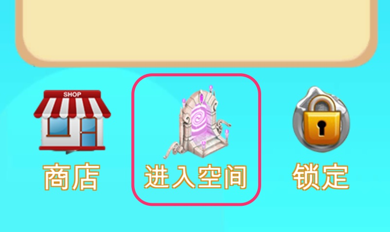
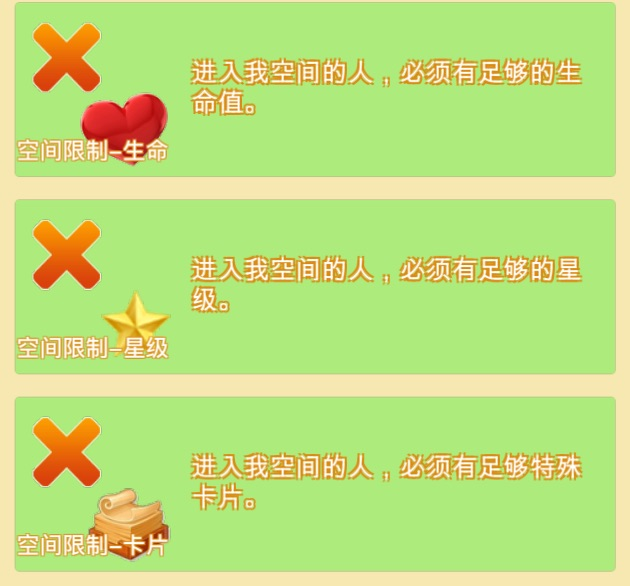

# EVR

[English](README.md)

这是一个用户[自治](#自治)的去中心化可扩展的虚拟世界。

在这个世界中，用户可以与其他用户交流，买卖卡片，并使用卡片来实现各种功能。

[新手介绍](intro-cn.md)

[下载](download.md)

### 生命值

在虚拟世界，每个角色都有生命值，生命值掉落（被[锁定](#锁定)）到0后，功能会受限，其他人眼中你也将变得不可见。

生命值可以用来：

- 购买其他用户的各种卡片。

- 攻击自己不喜欢的角色。

- 足够多的生命值，加上[转移限制](#转移限制)可以提升星级

[如何提高生命值](how-to-life-cn.md)

### 卡片

卡片可以用来执行各种功能，也可以成为身份的象征。

通过公开的[卡片功能](how-to-card-cn.md#功能)，用户可以自制卡片并出售。

[如何制作卡片](how-to-card-cn.md)

### 星级

星级用来直观反应用户的可信度；

- 1星需要 一千生命，转移限制 50% 每月；即，要是对方做坏事，在一个月内至少可以锁定对方 500 个生命值；
一星才能修改头像。

- 2星需要 五万生命，转移限制 20% 每月。对方生命值高，转移限制高，这是一个可以与之半年以上中期合作的帐号。
二星有特殊边框，容易识别。并且二星能起类似 **？？** 的别名。

- 3星需要 一百万生命，转移限制 10% 每月。这是可以与之长期合作的帐号。

### 转移限制

如果用户可以随意转移自己的生命，那么他将没那么容易取得信任。所以，用户通过限制自己转移生命的数量，来取得其他人的信任。（我的生命值无法快速转走，所以，我是不会一下就跑路的。）

为了防止账户被盗而损失全部生命，用户也可以选择设置转移限制，这样即使被盗，只要找回帐号，就只会损失一小部分生命。

在设置限制后，用户每月只能转出一定比例的生命（转入无限制），比如设置 10%限制，公有1000的生命，那么用户每个月就只能转出 100生命。

注：

1，由于转出量由剩余量决定，如果一次转一大笔，会比定的比例少得多。比如：50% 限制时，一次转出只能转出 1/3，因为 1/3 = (1 - 1/3) / 2。可以换成多次转出。

2，升星时需要设置转移限制。

### 锁定

用户之间总会有各种冲突或者需要沟通的地方，这时，可以选择花费自己一定量的生命，锁定对方同样数量的生命。

在查看用户时，点击锁定并输入需要锁定的数量和留言后，即可锁定对方一定量生命。

和解后，可以点击用户锁定列表进行解锁。

对方也可以支付90%的锁定生命进行和解。这用于消费场景。

### 自治

每个人都可以随意锁定不喜欢的用户，但锁定者也要付出相应的生命值。希望这能创造出一个没有骗子、也没有骚扰者的安全空间。

### 个人空间

每个用户都有一个空间，其他人也可以在这个空间中使用开店卡。

放置一个自己坐着的分身用来出售货物。

一个空间最多显示 10 个坐着的人物，按照支持的生命量排序。

用户可以设置自己空间的[进入限制](limit.md)。

注意：被空间主人锁定的用户，将无法在空间中开店。

### 宝藏卡

每个人都要想要做的事情，为了让多人一起做一件事，设计了这个宝藏卡功能。

- 用户通过买进宝藏卡来确认一起做事的意愿；

- 通过其他卡片的使用收入向宝藏卡输送宝藏；

- 之后通过使用宝藏卡来对宝藏进行收获。

注：本功能还在尝试运行中，之后功能会有一定的增加和修改。

### 空间限制卡

通过购买相应限制卡，可以给空间设置限制来阻止进入；

- 生命限制 （生命值必须高于一个值才能进入）

- 星级限制 （星级必须高于或等于一个值才能进入）

- 卡片限制 （必须持有一定数量的某种矿卡才能进入）

点击卡片的说明按钮，再点击说明复制卡片ID；

使用卡片，并将ID和限制数量输入；

### 更多功能

[查看更多功能](more.md)
