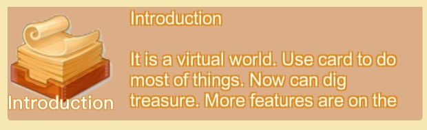
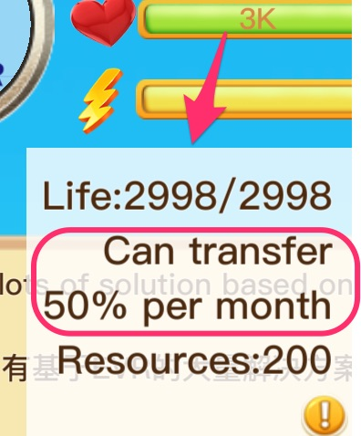
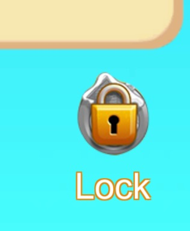
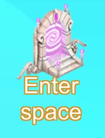
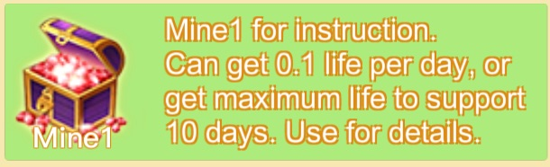
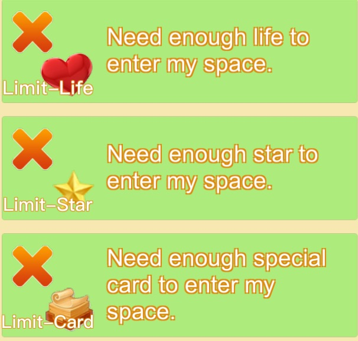

# EOSVR

[中文](README-cn.md)

A decentral and extendable virtual world based on EOS block chain.

In this world, users can communicate with others, buy or sell cards. And use cards to do lots of interesting things.

[Introduction](intro.md)

[Download](download.md)

### Life

In virtual world, if a user's life drop down ([locked](#lock)) to 0. Functions will be limited, and others can not see the user.

Life can:

- Buy cards of other users;

- Attack (lock) other user's life;

- With enough life and [transfer limitation](#Transfer-Limitation), user can increase [star level](#Star-Level).

[How to increase life?](how-to-life-cn.md)

### Card

Card can do lots of things.

With [card functions](how-to-card.md#Functions), user can make new cards and sell them.

[How to create cards?](how-to-card-cn.md)

### Star-Level

Star level show the trust level of a user;

- Star 1 need 1000 life and 50% transfer limitation. It said that other can lock its 500 life if the user do evil;
And star 1 can change portrait.

- Star 2 need 50K life and 20% transfer limitation. These accounts is trustable and can co-operate long period such as half a year.

And star 2 can show account like **????**.

- Star 3 need 1M life and 10% transfer limitation.

### Transfer-Limitation

After set transfer limitation, user can only transfer part of life to another per month. Example:

  User A has 1000 life, and set limitation to 10. Then A can only transfer 100 life to another user per month.

If a user can transfer its life away freely, it is not trustable. And when the transfer is limited, it is more trustable. (I can not transfer all of my life, and will not run away without punishment)

To avoid loss of all life by hacker, user can set limitation too.

Note:

1, The limitation rate is defined by rate of transfered life .vs. remain life. If transfer lots of life at one time, can only transfer smaller than expected. 

Example: 50% limitation can only transfer 1/3 at one time, because 1/3 = (1-1/3) * 50%.

Can transfer in several times.

2, Star Level need transfer-limiation.

### Lock

Users will conflict with each other. At this time, one user can use certain life to lock another with the same number of life.

To lock a user, view this user and click "Lock" button and input life number to lock.

Locker can unlock it at any time.

The user who is locked can pay 90% locked life to unlock too. 

### Autonomous

Every user can lock another, and both need to pay. It may create a autonomous space without spam and cheater.

### Personal Space

- Every account have a personal space.

- Space owner can [set the limitation](#Space-Limit-Card) to enter.

- Other can sit in the space to sell cards.
 

A space can sit at most 10 users, sorted by supported life.

Note: a user locked by space owner, can not sell cards in the space.

### Treasure-Card

Treasure card is for the users who want to work together.

- Users buy cards to prove they want to do something;

- All users send life to card by other cards.

- Use card to get life.

Note: It is in alpha version and may change later.

### Space-Limit-Card

Buy space limit card and use it to limit other user to enter space:

- Life Limit (Life must be bigger than certain value)

- Star Limit (Star Level must be bigger than certain value)

- Card Limit (Must have certain number of a special card)

Click note of card, and click the note words to copy card ID;

Use card and paste the card ID and number limitation;

### More

[View More Features](more.md)
