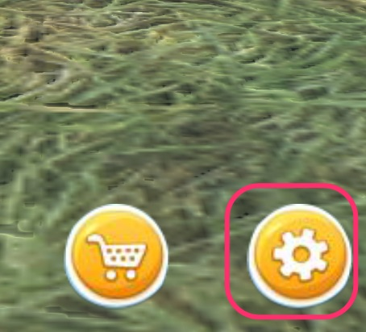
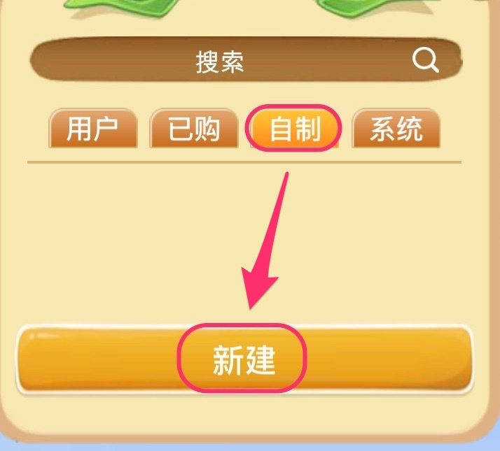
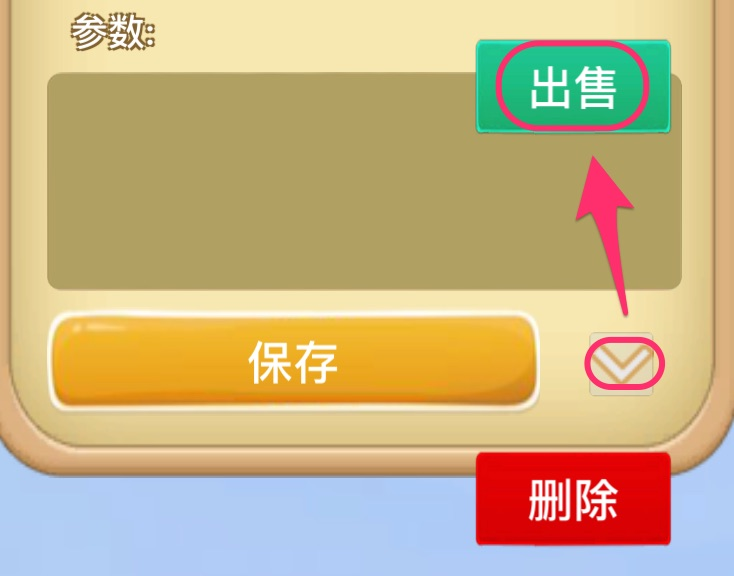
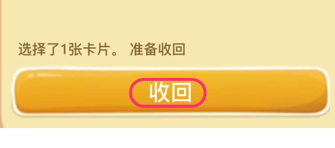

## 如何制作卡片并出售

### 新建

点击右下角的系统按钮，

在自制页面中点击 新建，就可以新建一张卡片。

新建完成后，存储就可以将卡片存下来。

### 功能

卡片目前只开启了如下几个功能：

1，打开一个链接；

2，弹出一个窗口显示提示；

3，其他用户的名片；

其他功能在开发测试中，将来新功能将会通过卡片实现。

### 出售/收回

在编辑卡片时，点击右下角的扩展箭头，再点击出售按钮，输入卡片总数，这张卡片就开始出售了。

打开自己的商店，选择正在出售的卡片，再点击收回按钮，可以将正在出售的卡片收回。

### 注意事项

1，卡片内容在出售过程中也能够进行编辑，所有已经卖出的卡片都将刷新；

2，卡片内容在出售过程中也可以修改价格；

3，每种卡片（无论数量是多少）都占用 0.01 生命；

