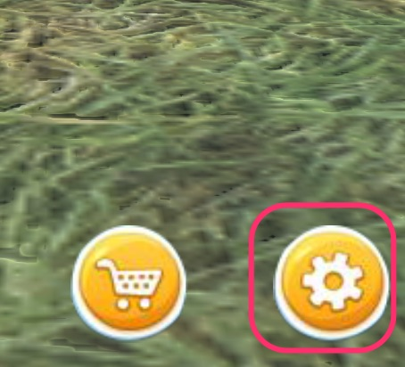

## Card

### Create

Click system button, 

And click custom page,

And click New to create a new card.

After edit, click save to save the card.

### Functions

Card's features:

1, Open a link;

2, Show a prompt page;

3, Show another user;

Other features are in development.

### Sell/Withdraw

When edit a card, click right-bottom button and click sell button to sell it;

In user's shop, select card and click withdraw to stop sell.

### Note

1, Can edit a card after sell too, and all sold cards will update too;

2, Can change price after sell;

3, One kind of card (in spite of number) take 0.01 life to save.

